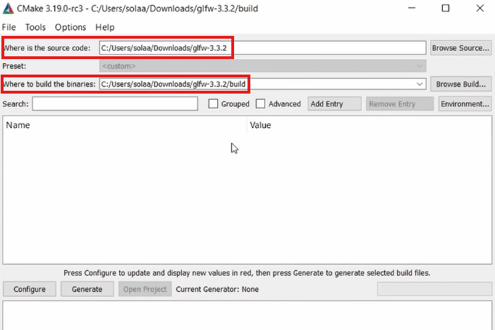
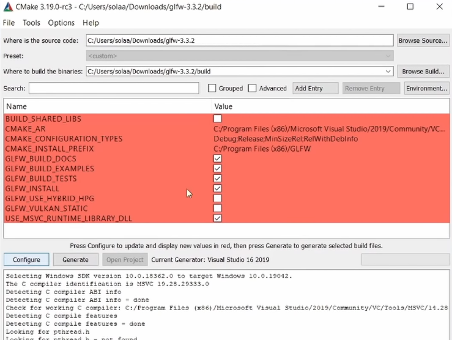
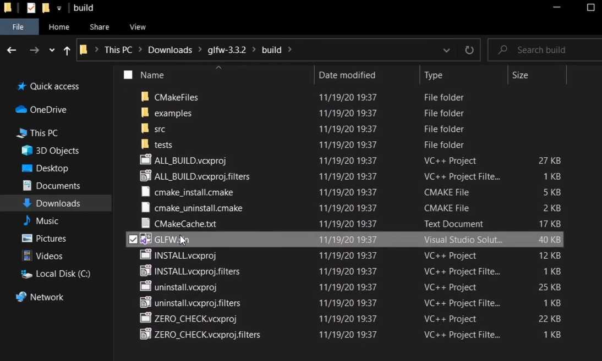
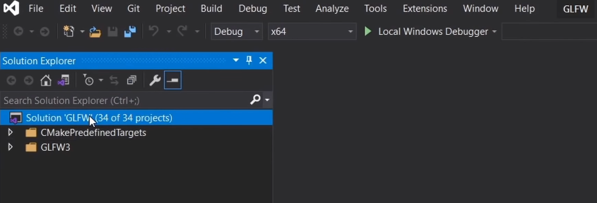
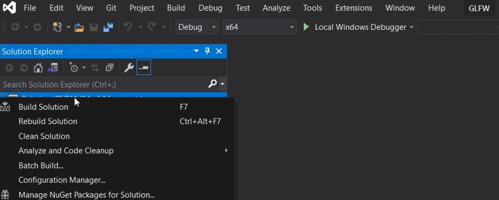
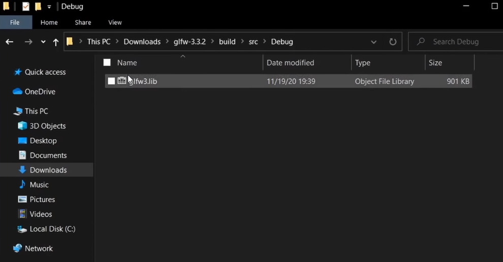
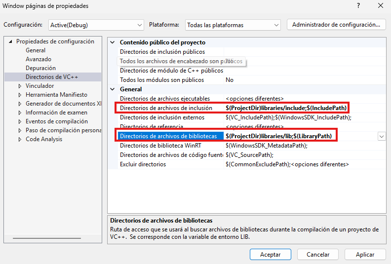
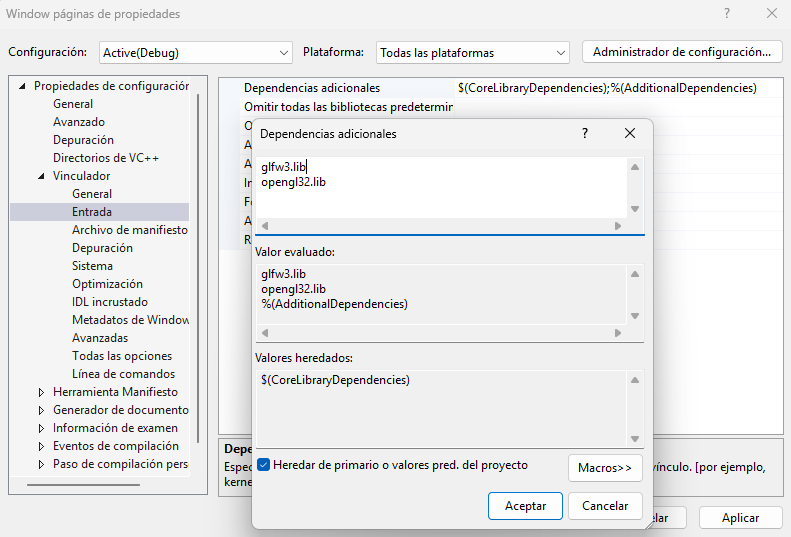
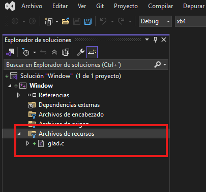

# Guía de Instalación y Preparación (C++ & OpenGL)

Esta guía detalla los pasos necesarios para configurar el entorno de desarrollo, compilar las dependencias y preparar un proyecto de gráficos utilizando **OpenGL 3.3 Core Profile**.

---

## Requisitos Previos

Antes de comenzar, asegúrate de tener instalado y descargado lo siguiente:

* **[Visual Studio Community 2022](https://visualstudio.microsoft.com/es/vs/community/)**: Durante la instalación, marca la carga de trabajo **"Desarrollo para el escritorio con C++"**.
* **[CMake](https://cmake.org/download/)**: Asegúrate de seleccionar la opción "Add CMake to the system PATH".
* **[GLFW](https://www.glfw.org/download)**: Descarga el "Source package".
* **[GLAD](https://glad.dav1d.de/)**: Genera los archivos con los siguientes parámetros:
    * **Language:** C/C++
    * **Specification:** OpenGL
    * **API gl:** Version 3.3
    * **Profile:** Core
    * **Options:** Generate a loader (seleccionado).

---

## 1. Compilación de GLFW con CMake

Para que Visual Studio pueda usar GLFW, primero debemos generar los binarios específicos para tu sistema.

1.  **Descomprime** el archivo de GLFW.
2.  Abre **CMake (GUI)**.
3.  En **"Where is the source code"**, selecciona la carpeta raíz de GLFW.
4.  En **"Where to build the binaries"**, selecciona una carpeta llamada `build` dentro de la carpeta de GLFW (si no existe, créala).

<p align="center">
  
</p>

5.  Presiona **Configure**, selecciona tu versión de Visual Studio y presiona **Finish**.

<p align="center">
  
</p>

6.  Presiona **Generate**. Una vez finalizado, presiona **Open Project** para abrir `GLFW.sln` en Visual Studio.

<p align="center">
  
</p>

### Generar el archivo .lib
1.  En Visual Studio, localiza la solución en el Explorador de Soluciones.

<p align="center">
  
</p>

2.  Haz clic derecho en la solución (o en el proyecto `glfw`) y selecciona **Build (Compilar)**.

<p align="center">
  
</p>

3.  Una vez finalizado, busca el archivo `glfw3.lib` en: `path/to/glfw/build/src/Debug/`.

<p align="center">
  
</p>

---

## 2. Estructura del Proyecto

Crea un nuevo **Proyecto Vacío de C++** en Visual Studio. En la carpeta raíz de tu proyecto, organiza los archivos de la siguiente manera:

```text
MiProyecto/
├── libraries/
│   ├── include/
│   │   ├── glad/      <-- de glad/include/
│   │   ├── KHR/       <-- de glad/include/
│   │   └── GLFW/      <-- de glfw/include/
│   └── lib/
│       └── glfw3.lib  <-- el que compilamos en el paso anterior
├── glad.c             <-- de glad/src/
└── main.cpp           <-- tu código fuente
```

Donde:

- La carpeta glad ubicada en `path/to/glad/include` lo copias a la carpeta `libraries/include` del proyecto.
- La carpeta KHR ubicada en `path/to/glad/include` lo copias a la carpeta `libraries/include` del proyecto.
- La carpeta GLFW ubicada en `path/to/glfw-x.y.z/include` lo copias a la carpeta `libraries/include` del proyecto.
- El archivo `glad.c` ubicada en `path/to/glad/src` lo copias em la raiz del proyecto
- El archivo `glfw3.lib` ubicada en `path/to/glfw-x.y.z/build/src/debug` lo copias en la carpeta de `libraries/lib` del proyecto.

## 3. Configuración de Visual Studio

Para que el proyecto compile, debes vincular las carpetas que acabas de crear:

1. Incluir Cabeceras:
     - Clic derecho en el proyecto -> `Properties`.
     - `C/C++` -> `General` -> `Additional Include Directories`.
     - Añade: `$(ProjectDir)libraries\include`
     - `C/C++` -> `General` -> `Additional Library Directories`.
     - Añade: `$(ProjectDir)libraries\lib`

<p align="center">
  
</p>


2. Vincular Librerías (.lib):
     - `Linker` -> `Inpu`t -> `Additional Dependencies`.
     - Escribe: *glfw3.lib*;*opengl32.lib*;

<p align="center">
  
</p>

3. Agregar glad.c
    - Copia el `glad.c` al **Source Files**

<p align="center">
  
</p>