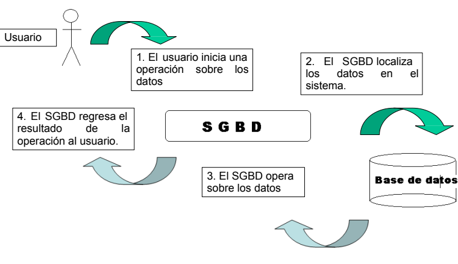
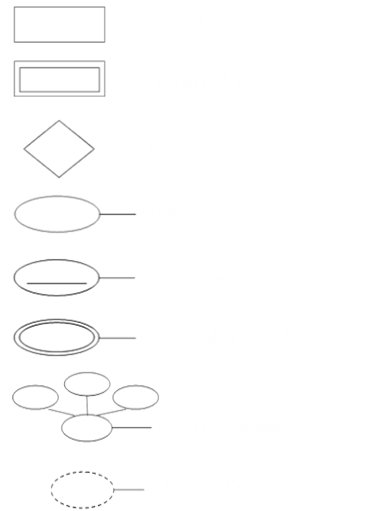

# Base de Datos

> **Nota**
> - **Dato**: Representación simbólica de un hecho (números, letras, símbolos). Ejemplo: `20`, `Jharvy Jonas`, `Decimo Superior`.
> - **Información**: Datos organizados que tienen sentido. Ejemplo: `Jharvy Jonas de 20 años esta en el decimo Superior`.
> - **Conocimiento**: Uso de la información para tomar decisiones. Ejemplo: `Como Jharvy es mayor de edad y pertenece al decimo superior, es apto para postular a una beca en el extranjero`.
> 
> En Resumen: 
>   **`Dato` -> `Informacion` -> `Conocimiento`**

### ¿Qué es una Base de Datos?

Colección organizada de datos que se almacenan y administran para que puedan ser consultados, modificados y gestionados facilmente.

Una base de datos es usualmente mantenida y accesada a través de un software conocido como Sistema Gestor de Base de Datos (SGBD). Normalmente un SGBD adopta un modelo de datos, de forma pura, reducida o extendida.

Ejemplos: 

- Relacionales: MySQL, PostgreSQL, Oracle, SQL server, SQLite.
- No Relacionales: MongoDB, Redis, Cassandra.

#### **Esquema del manejador de la base de datos (SGBD)**

  

#### Modelos de bases de datos

Un modelo de datos es una representación relativamente sencilla de estructuras de datos reales más complejas. Un modelo es una abstracción de un objeto o hecho real más complejo.

- **Modelo Jerarquico**
    Los datos se organizan en forma de árbol con una estructura padre-hijo. Cada registro (nodo) puede tener muchos hijos, pero solo un padre. Su funcionamiento se basa en la navegacion desde la raiz hacia las hojas siguiendo el camino jerarquico Ejemplo: Una empresa -> departamentosd -> empleados

- **Modelo de Red**
    Similar al jerárquico, pero los nodos pueden tener múltiples padres y relaciones muchos a muchos. Los datos estan organizandos en forma de grafo, con nodos y enlaces.

- **Modelo Relacional**
    Los datos se organizan en tablas (relaciones) con filas (tuplas) y columnas (atributos). Las tablas se conectan mediante claves primarias y foráneas. Funciona a travez de SQL.

- **Modelo Orientado a Objetos**
    Integra conceptos de POO en la base de datos. Los datos se guardan como objetos, con atributos y métodos. Funcionan a travez de un OQL.

- **Modelo Hibrido**
    Combina dos o más modelos para aprovechar lo mejor de cada uno. Ejemplo: bases de datos multimodelo que soportan tablas relacionales y documentos NoSQL.
     
## Modelado Entidad - Relacion

El Modelo ER es una forma conceptual de representar los datos y sus relaciones en un sistema. Fue propuesto por Peter Chen en 1976.
Se utiliza principalmente en la etapa de diseño de bases de datos para describir cómo la información del mundo real será representada en un sistema.

1. **Entidades**
    Son representaciones de objetos o cosas del mundo rela que tienen existencia independiente, pueden ser físicas o conceptuales Ejemplo: Persona, auto, curso, pedido, reserva, etc. Se representa como un rectangulo.
   1. **Entidad Fuerte**
        Se dice que una entidad es fuerte si puede existir por sí misma sin que dependa de la existencia de otra entidad como por ejemplo la entidad Factura (NumFactura es PK). Se representa como un rectangulo simple.
   2. **Entidad Debil**
        Una entidad débil es aquella que no puede existir sin participar en la relación; es decir, aquella que no puede ser unívocamente identificada solamente por sus atributos por ejemplo DetalleFactura (debil, porque no tiene sentido sin una factura). Se representa con un rectangulo doble.
2. **Atributos**
    Los atributos son las propiedades o características que describen a una entidad o una relación.
   1. **Atributo Simple**
        No se puede dividir en partes más pequeñas como DNI, nombre, etc. Se representa como un ovalo simple      
   2. **Atributo Compuesto**
        Puede dividirse en subcomponentes como Direccion, que puede dividirse en calle, ciudad, pais, etc. Se presenta como un ovalo con hijos ovalos.
   3. **Atributo Derivado**
        Su valor se obtiene de otros atributos como la edad, que deriva del atributo Fecha de Nacimiento. Se presenta como un ovalo punteado.
   4. **Atributo multivaluado**
        Puede tener más de un valor para una entidad como el atributo telefono, ya que una persona puede tener varios numeros de telefono. Se presenta como un ovalo doble.
   5. **Atributo Key**
        Es el atributo (o conjunto de atributos) que identifica de forma única a una entidad fuerte como el DNI a una entidada Usuario. Se representa como un ovalo subrayado.
3. **Relaciones**
    Es una asiciacion entre dos entidades, es representado comunmente con un rombo. Ejemplo:
    - Medico -- (Consulta) -- Paciente
    Algunas veces, la relacion tambien tiene atributos.
   1. **Relacion Uno a Uno: (1:1)** 
        Una ocurrencia de A está asociada como máximo a una ocurrencia de B, y una ocurrencia en B está asociada a no mas de una ocurrencia en A.
        **Ejemplo: Persona-Pasaporte**
        - Una persona tiene un solo pasaporte
        - Un pasaporte pertenece a una sola persona
   2. **Relacion Uno a Muchos (1:N)** 
        Una ocurrencia de A está asociada a varias ocurrencias de B, pero una ocurrencia de B debe estar asociada como máximo a una ocurrencia en A.
        **Ejemplo: Cliente-Pedido**
        - Un Cliente puede hacer muchos pedidos
        - Cada pedido pertenece a un solo cliente
   3. **Relacion Muchos a Muchas (N:N)** 
        Una ocurrencia de A está asociada a cualquier número de ocurrencias de B, y una ocurrencia en B está asociada a cualquier número de ocurrencias en A
        **Ejemplo: Alumno-Curso**
        - Un alumno puede matricularse en muchos cursos
        - Un curso puede tener muchos alumnos

Representaciones graficas de las entidades, atributos y relaciones:

  

